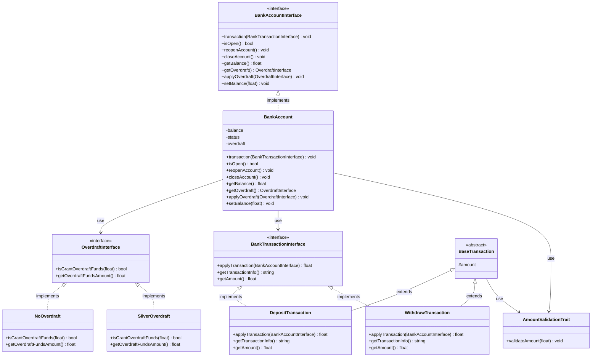
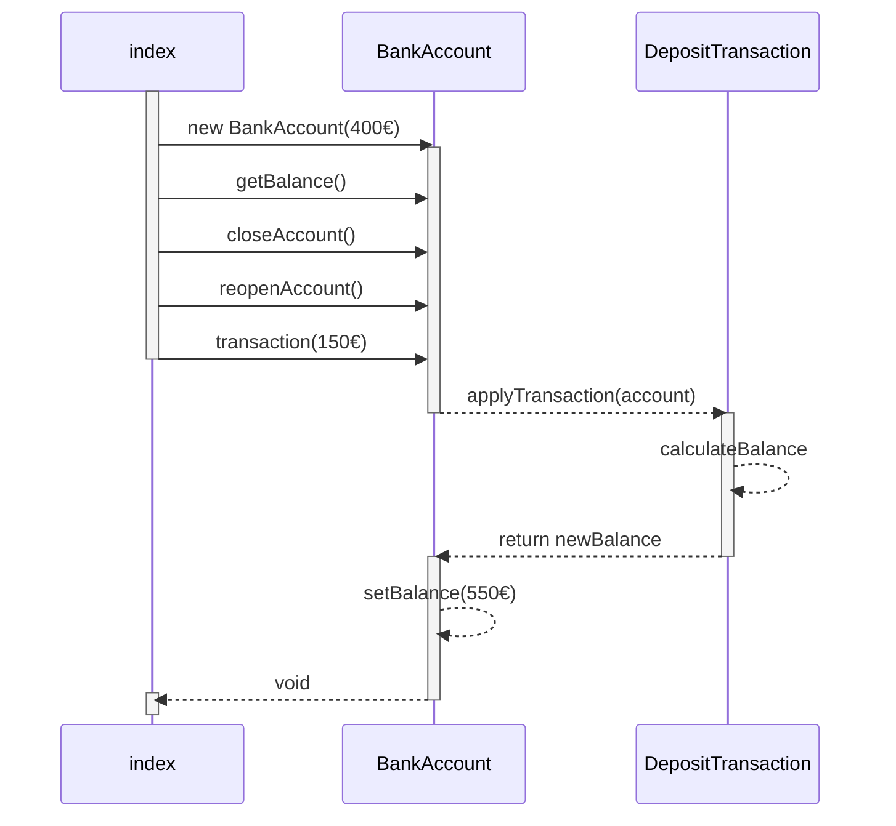

## About ComBank application
> Using this small program to explain about the OOP and PHPUnit.

> To run the program, please read the follow:
#### Requirements
* PHP 8.x

#### Features
1. Open account
2. Apply overdraft
3. Deposit funds
4. Withdraw funds
5. Display balance
6. Close account

#### Installation
```
git clone
```

#### Run Unit Test
```
./vendor/bin/phpunit ./tests
```

#### Manual Test
```
php src/index.php
```

#### Class Diagram


#### Sequence Diagram



